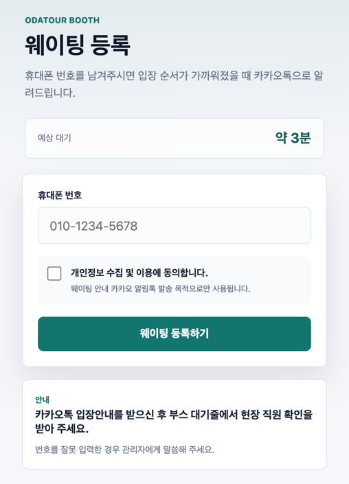
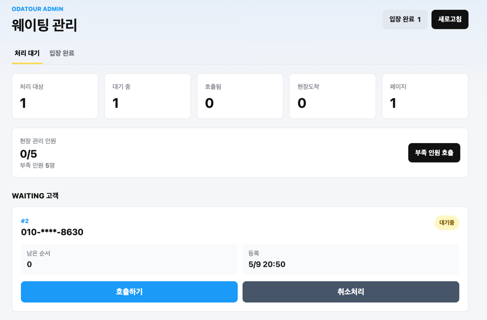

# Odatour Waiting System

오다투어 박람회 부스 방문자를 위한 웹 기반 웨이팅 관리 시스템입니다. 방문자는 QR 코드로 접속해 휴대폰 번호만 입력하면 웨이팅을 등록할 수 있고, 운영자는 관리자 화면에서 호출, 현장도착 확인, 입장완료, 노쇼, 취소 처리를 진행할 수 있습니다.

별도 모바일 앱이나 실시간 대기열 인프라 없이 Spring Boot, Thymeleaf, JDBC 기반 서버 렌더링 웹 애플리케이션으로 동작합니다. 호출/노쇼 알림은 SOLAPI 카카오 알림톡 연동을 통해 발송합니다.

## Screenshots

### 방문자 웨이팅 등록



### 관리자 웨이팅 관리



## 주요 기능

- 방문자 웨이팅 등록
  - 휴대폰 번호 입력
  - 개인정보 수집 및 이용 동의
  - 동일 휴대폰 번호의 진행 중 웨이팅 중복 등록 방지
- 방문자 대기 상태 확인
  - 남은 순서 표시
  - 예상 대기시간 표시
  - 새로고침으로 최신 순서 확인
  - 웨이팅 취소
- 관리자 운영 화면
  - 현재 처리 대상 웨이팅 목록 확인
  - 상태별 요약 지표 확인
  - 부족 인원 일괄 호출
  - 개별 카카오 알림톡 호출 및 노쇼 알림 발송
  - 현장도착 확인, 입장완료, 노쇼, 취소 처리
  - 처리 완료 목록 별도 확인
- 운영 데이터 저장
  - 로컬 개발: 파일 기반 H2
  - 운영 배포: PostgreSQL

## 웨이팅 상태 흐름

```text
WAITING -> CALLED -> ARRIVED -> ENTERED
WAITING -> CANCELED
CALLED  -> NO_SHOWED
ARRIVED -> NO_SHOWED
CALLED  -> WAITING   (관리자 되돌리기)
ARRIVED -> CALLED    (관리자 되돌리기)
ENTERED -> ARRIVED   (관리자 되돌리기)
NO_SHOWED -> CALLED  (관리자 되돌리기)
```

| 상태 | 의미 |
| --- | --- |
| `WAITING` | 등록 후 아직 호출되지 않은 상태 |
| `CALLED` | 카카오 알림톡으로 호출된 상태 |
| `ARRIVED` | 방문자가 부스 대기줄에 도착해 운영자가 확인한 상태 |
| `ENTERED` | 방문자가 실제 체험을 시작한 상태 |
| `NO_SHOWED` | 호출 후 현장에 오지 않았거나 운영자가 노쇼 처리한 상태 |
| `CANCELED` | 호출 전 방문자 또는 관리자가 취소 처리한 상태 |

## 화면 및 경로

| Method | Path | 설명 |
| --- | --- | --- |
| `GET` | `/` | 방문자 웨이팅 등록 화면 |
| `POST` | `/waitings` | 웨이팅 등록 |
| `GET` | `/waitings/{id}` | 방문자 대기 상태 화면 |
| `POST` | `/waitings/{id}/cancel` | 방문자 웨이팅 취소 |
| `GET` | `/admin/waitings` | 관리자 처리 대기 목록 |
| `GET` | `/admin/waitings/entered` | 관리자 처리 완료 목록 |
| `POST` | `/admin/waitings/{id}/notify` | 개별 카카오 알림톡 호출 |
| `POST` | `/admin/waitings/notify-shortage` | 부족 인원 일괄 호출 |
| `POST` | `/admin/waitings/{id}/arrive` | 현장도착 확인 |
| `POST` | `/admin/waitings/{id}/enter` | 입장완료 처리 |
| `POST` | `/admin/waitings/{id}/no-show` | 노쇼 처리 |
| `POST` | `/admin/waitings/{id}/cancel` | 관리자 취소 처리 |
| `POST` | `/admin/waitings/{id}/revert` | 관리자 처리 되돌리기 |

## 기술 스택

- Java 25
- Spring Boot 4.0.6
- Spring Web MVC
- Spring JDBC
- Thymeleaf
- Gradle
- H2 Database
- PostgreSQL
- SOLAPI 카카오 알림톡
- Docker / Docker Compose

## 로컬 실행

Java 25가 필요합니다.

```bash
./gradlew bootRun
```

애플리케이션은 기본적으로 `http://localhost:8080`에서 실행됩니다.

`SPRING_DATASOURCE_URL`을 지정하지 않으면 `.local-data/` 아래에 파일 기반 H2 데이터베이스가 생성됩니다.

```text
http://localhost:8080
http://localhost:8080/admin/waitings
```

## 환경 변수

로컬 또는 서버 환경에서 `.env.example`을 참고해 `.env` 파일을 구성할 수 있습니다.

| 변수 | 설명 |
| --- | --- |
| `SPRING_DATASOURCE_URL` | 운영 DB JDBC URL. 미지정 시 로컬 H2 사용 |
| `SPRING_DATASOURCE_USERNAME` | DB 사용자명 |
| `SPRING_DATASOURCE_PASSWORD` | DB 비밀번호 |
| `SPRING_H2_CONSOLE_ENABLED` | H2 콘솔 사용 여부 |
| `SOLAPI_API_KEY` | SOLAPI API 키 |
| `SOLAPI_API_SECRET_KEY` | SOLAPI API 시크릿 |
| `SOLAPI_FROM` | 발신 번호 |
| `SOLAPI_KAKAO_PF_ID` | 카카오 채널 PF ID |
| `SOLAPI_KAKAO_CALL_TEMPLATE_ID` | 승인된 호출 알림톡 템플릿 ID |
| `SOLAPI_KAKAO_NO_SHOW_TEMPLATE_ID` | 승인된 노쇼 알림톡 템플릿 ID |
| `SOLAPI_KAKAO_DISABLE_SMS` | 알림톡 실패 시 SMS 대체 발송 비활성화 여부 |

카카오 알림톡 호출 및 노쇼 알림 기능을 실제로 사용하려면 SOLAPI 관련 값을 모두 설정해야 합니다.

## 테스트

```bash
./gradlew test
```

## 운영 배포

운영 환경은 Docker 이미지와 PostgreSQL을 `docker compose`로 함께 실행하는 구성을 기준으로 합니다.

```bash
docker compose up -d
```

자세한 배포 절차와 GitHub Actions 설정은 [docs/deploy.md](docs/deploy.md)를 참고하세요.

## 문서

- [요구사항](docs/requirements.md)
- [배포 설정](docs/deploy.md)
- [개발 계획](docs/plan.md)
